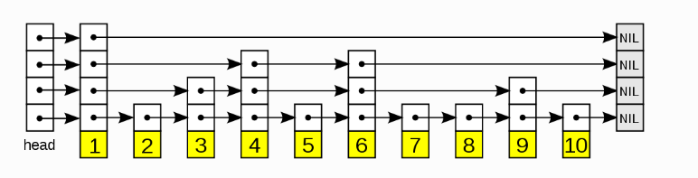

## 跳跃表

跳跃表(skip list) 是一种顺序单向链表，在有序链表基础上增加了多级索引，通过索引实现快速查找，实质是一种可以进行二分查找的有序链表。



- 跳跃表由多条分层的链表组成，每条链表中的元素都是有序的
- 每条链表都有 正无穷 和 负无穷 两个元素分别代表链表的头部和尾部
- 上层链表元素集合是下层链表元素集合的子集
- 跳跃表的高度定义为水平链表的层数

```java
public class SkipListNode<T>{
    private T value;
    private double score;
    private List<SkipListNode> nextNodes;
    
    public SkipListNode(T value, double score){
        this.value = value;
        this.score = score;
        this.nextNodes = new ArrayList<>();
    }
}

public class SkipList<T> {
    private SkipListNode head;
    private int maxLevel;
    private int size;
    private final double PROBABILITY = 0.5;

    public SkipList(){
        size = 0;
        maxLevel = 0;
        head = new SkipListNode(null);
        head.nextNodes.add(null);
    }
}
```

### 查找

跳跃表的查询是从上往下开始的，从最上层的链表头部开始，如果当前节点后继节点的值小于等于查询的值则沿着这条链向后查询，否则切换到当前节点的下一层链表，然后继续比较当前节点的后继节点的值与带查询的值，重复这个步骤直到找到查询的值或者后继节点为 null 为止。

跳跃表查找时间复杂度为 `O(lgN)`
```java
public T get(double score){
    SkipListNode<T> node = find(head, score, level);
    if (node.score != score){
        return null;
    }
    return node.value;
}

public SkipListNode<T> find(SkipListNode<T> current, double score, int level){
    do {
        current = findNex(current, score, level);
    }while (level-- > 0);
    return current;
}


/**
 * 返回当前层不大于给定值的最大节点
 */
public SkipListNode<T> findNex(SkipListNode<T> current, double score, int level){

    SkipListNode<T> nextNode = current.nextNodes.get(level);
    while (nextNode != null){
        if (score < nextNode.score){
            break;
        }
        current = nextNode;
        nextNode = current.nextNodes.get(level);
    }
    return current;
}
```

### 插入

跳跃表的插入首先需要按照查找流程找到待插入元素的前驱和后继，然后按照随机算法生成一个高度值作为新节点的层数，最后按照层数和值创建一个节点并插入到跳跃表的多层链表中，插入之后需要调整每层链表的前驱和后继节点的指针，如果节点的层数大于跳跃表的高度则更新跳跃表的高度。

```java
/**
 * 添加值需要先找到对应节点的位置，然后哦随机生成 level，最后需要维护每层之间的引用关系
 */
public void add(T v, double score){
    SkipListNode<T> prev = find(head, score, level);
    // 已经存在值了
    if (prev.score == score){
        return;
    }
    size++;

    // 随机生成 level
    int newLevel = getRandomLevel();
    // head 节点的 level 最高
    while (level < newLevel){
        head.nextNodes.add(null);
        level++;
    }

    // 从最高层开始构建引用关系
    SkipListNode<T> newNode = new SkipListNode<>(v, score);
    SkipListNode<T> current = head;
    do {
        SkipListNode<T> next = findNex(current, score, newLevel);
        newNode.nextNodes.add(0, current.nextNodes.get(newLevel));
        current.nextNodes.set(newLevel, newNode);
    }while (newLevel-- > 0);
}
```

### 删除

```java

```


```java
class SkipListNode{
    // 节点数据
    public Integer value;
    // 指向的下个节点，每层都会指向一个节点
    public ArrayList<SkipListNode> nextNodes;

    public SkipListNode(Integer value){
        this.value = value;
        nextNodes = new ArrayList<>();
    }
}

class SkipListIterator implements Iterator<Integer>{
    SkipList list;
    SkipListNode current;

    public SkipListIterator(SkipList list){
        this.list = list;
        this.current = list.getHead();
    }

    public boolean hasNext(){
        return current.nextNodes.get(0) != null;
    }

    public Integer next(){
        current = current.nextNodes.get(0);
        return current.value;
    }
}

class SkipList{
    private SkipListNode head;
    private int maxLevel;
    private int size;
    private final double PROBABILITY = 0.5;

    public SkipList(){
        size = 0;
        maxLevel = 0;
        head = new SkipListNode(null);
        head.nextNodes.add(null);
    }

    public SkipListNode getHead(){
        return head;
    }

    public void add(Integer newValue){
        if(!contains(newValue)){
            size++;
            int level = 0;
            while(Math.random() < PROBABILITY){
                level++;
            }
            // head 层数与最高层相同
            while(level > maxLevel){
                head.nextNodes.add(null);
                maxLevel++;
            }
            SkipListNode newNode = new SkipListNode(newValue);
            SkipListNode current = head;
            do{
                // 找到当前层不大于值的节点
                current = findNext(newValue, current, level);
                newNode.nextNodes.add(0, current.nextNodes.get(level));
                // 每层之间连接
                current.nextNodes.set(level, newNode);
            }while(level-- > 0);
        }
    }

    public void delete(Integer value){
        if(contains(deleteValue)){
            SkipListNode deleteNode = find(deleteValue);
            size--;
            int level = maxLevel;
            SkipListNode current = head;
            do{
                current = findNext(deleteNode.value, current, level);
                if(deleteNode.nextNodes.size() > level){
                    current.nextNodes.set(level, deleteNode.nextNodes.get(level));
                }
            }while(level-- > 0);
        }
    }

    public SkipListNode find(Integer e){
        return find(e, head, maxLevel);
    }

    // 
    public SkipListNode find(Integer e, SkipListNode current, int level){
        do{
            current = findNext(e, current, level);
        }while(level-- > 0);
        return current;
    }

    // 如果当前节点右边的节点比当前节点大则返回当前节点
    public SkipListNode findNext(Integer e, SkipListNode current, int level){
        // 右边节点
        SkipListNode next = current.nextNodes.get(level);
        while(next != null){
            Integer value = next.value;
            if(lessThan(e, value)){
                break;
            }
            current = next;
            next = current.nextNodes.get(level);
        }
        return current;
    }

    public int size(){
        return size;
    }

    public boolean contains(Integer value){
        SkipListNode node = find(value);
        return node != null && node.value != null && equalTo(node.value, value);
    }
}
```

https://blog.csdn.net/qpzkobe/article/details/80056807

https://www.cnblogs.com/acfox/p/3688607.html