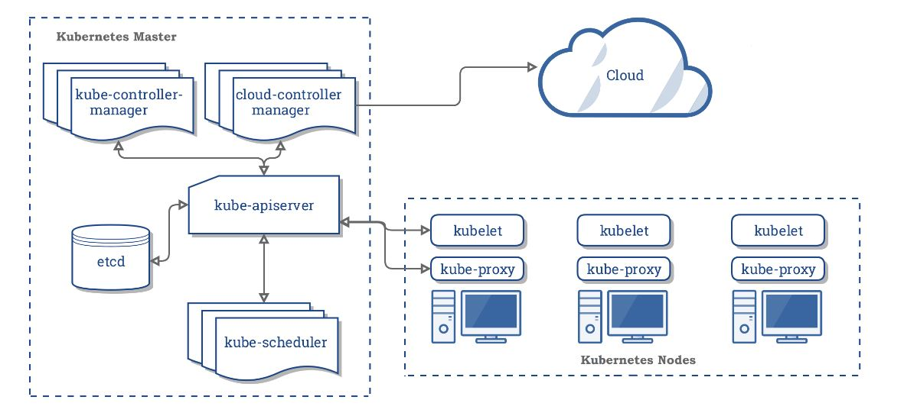

### Kubernetes 架构

Kubernetes是一个可移植的、可扩展的、开放源码的平台，用于促进声明性配置和自动化管理容器化的工作负载和服务。



#### Master

Kubernetes 中 Master 是集群的控制节点，负责整个集群的管理和控制，基本上所有的控制命令都是发送给 Master 然后由 Master 具体执行。 Master 节点中运行的进程：

- ```kube-apiserver```：提供 HTTP Rest 接口的进程，是 kubernetes 中资源的增、删、改、查等操作的唯一入口
- ```kube-scheduler```：资源调度进程，根据集群内各个 Node 的可用资源以及要运行的容器的资源需求做出调度决策
- ```kube-controller-manager```：集群控制进程，运行管理集群的 controller 线程：
  - ```Node Controller```：负责监听和报告节点的状态
  - ```Replication Controller```：负责维护集群中的 pod 数量和需求的数量一致
  - ```Endopoints Controller```：操作 Endpoints 对象，也就是使 Service 和 Pod 链接起来
  - ```Service Account & Token Controller```：为新 namespace 创建账户和 token

Master 通常部署在独立的服务器上，为了高可用一般会部署 3 个 Master 并通过 etcd 实现主备切换。

#### Node

Kubernetes 集群中的工作负载节点成为 Node，每个 Node 上运行着由 Master 分配的负载(容器)，当 Node  宕机时其上运行的负载将会由 Master 自动转移到其他的 Node 上。 每个 Node 上运行的进程：

- ```kubelet```：负责与 `apiserver` 交互更新状态并完成 Pod 对应的容器的创建、启停等任务，同时与 Master 协作实现集群的管理
- ```kube-proxy```：在主机上维护网络规则并执行连接转发来实现 Kubernetes 服务抽象
- `Docker Engine` 负责 Docker 容器的创建和管理

Node 可以在运行期间动态的增加到 Kubernetes 集群中，默认情况下 kubelet 进程会像 Master 注册当前 Node，一旦 Node 被纳入 Kubernetes 的集群管理中，kubelet 就会定时向 Master 上报 Node 的资源以及负载信息，如果在指定超时时间没有上报信息则 Master 认为 Node 不可用并触发负载转移机制。

```sh
# 查看集群 node
kubectl get nodes
# 查看 node 信息
kubectl describe node <node_name>
```


### Kubernetes 核心概念

// todo

#### Label

Label 是一个键-值对，用于附加在 Kubernetes 的对象上进行标识。每个对象可以有多个 Label，并且一个 Label 可以添加到多个对象上。

Label 在 `yml` 文件的 `metadata.labels` 中定义，也可以在资源对象创建后使用 `kubectl label <pod_name> key=value` 为对象添加 Label。可以使用 `kubectl get <node_name> --show-labels` 查看对象的 Label：

```sh
# 给资源对象添加 label
kubectl label <pod_name> key=value
# 查看资源对象的 label
kubectl get <pod_name> --show-labels
```

通过标签可以对资源对象实现多维度的分组管理功能，包括部署、监控等，常用的 Label 有：

-  版本标签(release)：stable, canary
- 环境标签(env)：dev, test, prod

给资源附加标签后，可以通过 `LabelSelector` 来筛选具有特定标签的对象实现分组查询，`LabelSelector` 提供了基于等式(Equality-based)的和基于集合(Set-based)的表达式用于匹配标签：

- `key=value`：匹配所有具有标签 `name:value` 的资源对象
- `key!=value`：匹配所有不具有 `name=value` 的资源对象
- `key in (value_set)`：匹配所有 `name=value` 其中 value 在集合中的资源对象
- `key not in (value_set)`：匹配所有 `name=value` 其中 value 不在集合中的资源对象

标签选择表达式可以组合实现复杂的条件选择，表达式之间使用 `,` 分隔表示 `AND` 即多个条件表达式同时满足：

```yml
apiVersion: v1
kind: Service
metadata:
	name: service_name
spec:
	replicas: 1
	selector:
		name:pod_label_test
	# ...
---	

# Deployment 使用基于集合的筛选
selector:
	matchLabels:
		name: pod_name
	matchExpressions:
		- {key: env, operator: In, values: [dev, test]}
			
```

标签选择器在 Kubernetes 中有比较重要的使用场景：

- `kube-controller` 进程通过资源对象 RC 定义的 `LabelSelector` 来筛选要监控的 Pod 副本数量，使的 Pod 的副本数量始终符合预期设定
- `kube-proxy` 进程通过 `Service` 的 `LabelSelector` 来选择对应的 Pod，自动创建每个 Service 到对应的 Pod 的请求转发路由表，从而实现 Service 的智能负载均衡机制
- 通过对 Node 定义特定的标签，并且在 Pod 定义文件中使用 `LabelSelector` 选择 Pod 指定调度策略，`kube-scheduler` 进程可以实现 Pod 的定向调度


#### NameSpace
命名空间是 Kubernetes 集群级别的资源，用于将集群分隔为多个隔离的逻辑分区以配置给不同的用户、租户。Kubernetes 命名空间的隔离只是资源名称上的隔离，而并非操作系统的命名空间隔离也不是物理上的隔离。

### Kubernetes 核心对象

Kubernetes 对象时 Kubernetes 系统中的持久实体，Kubernetes 使用这些实体来表示集群的状态，包括：

- 节点上运行的容器化应用程序
- 应用程序的可用资源
- 应用程序的行为策略，包括启动、升级、容错等策略

Kubernetes 对象一旦创建就能确保存在，通过创建对象的方式可以告诉 Kubernetes 希望的集群状态。对 Kubernetes 对象的所有操作，不管是创建、修改还是删除，都需要使用 Kubernetes API


Kubernetes 的对象使用 .yml 文件描述，每个对象描述文件分为 3 部分：元数据(metadata)、规范(spec) 和 状态(status)。状态描述了对象的当前状态，由Kubernetes系统及其组件提供和更新。Kubernetes控制平面持续地、主动地管理每个对象的实际状态，以匹配您提供的所需状态。

#### Pod

Pod 是 Kubernetes 的基本调度单元，每个 Pod 由一个 `pause` 容器以及一个或多个业务容器组成，同一个 Pod 中的容器共享相同的网络命名空间、IP 地址和端口以及存储卷空间。

Kubernetes 为每个 Pod 分配了唯一的 IP 地址，集群内 Pod 的容器之间可以可以直接通信。

#### Service

### Kubernetes 安装
#### minikube
```shell

```
#### kubeadm
kubeadm 是 kubernetes 项目自带的集群构建工具，负责执行构建一个最小化的可用集群以及将其启动等的必要基本步骤。kubeadm 包含多个组件：
- kubeadm init：部署 Master 节点的各个组件
- kubeadm join：将节点加入到指定集群中
#### Rancher
安装 rancher
```shell
# 通过 docker 安装 rancher
docker run -d --restart=unless-stopped -p 80:80 -p 443:443 rancher/rancher:stable
```
通过 https://ip:443 访问 rancher，默认用户名和密码都是 admin
### Kubernetes 基本操作
Kubernetes 使用 API 对象来描述集群的所需状态，通过 Kubernetes API(通常通过命令行界面 kubectl) 创建对象来设置所需的状态，一旦设置了所需的状态，Kubernetes 就会通过 Pod 生命周期事件生成器使集群的当前状态与所需的状态匹配。

#### yaml

在Kubernetes中创建对象时，必须提供描述其所需状态的对象规范，以及有关该对象的一些基本信息（例如名称）。当您使用kubernetes API 创建对象（直接或通过kubectl），API请求必须在请求主体中以JSON的形式包含该信息。通常，您在.yaml文件中向kubectl提供信息。kubectl在发出API请求时将信息转换为JSON。


Kubernetes 使用 `ym`l 文件描述资源对象，`yml` 文件必须包含 4 部分：

- `apiVersion`：指定用于创建对象的 Kubernetes API 版本
- `kind`：需要创建的对象类型
- `metadata`：资源对象的元数据，包括 name, uid 等能够唯一标识对象的数据
- `spec`：资源对象的具体描述

```yml
apiVersion: v1
kind: Pod
metadata:
	name: res_name
	labels:
	- label_key: label_value
spec:
	# 对象容器描述
	containers:
	- name: pod_container
      image: pod_image
      # ...
```


#### kubectl

Kubernetes 提供了命令行工具 kubectl 用于和 api-server 交互并管理资源。kubectl 提供了多种子命令用于资源的增删改查，其语法为：

```shell
kubectl <COMMAND> <TYPE> [NAME] [flags]
```
- ```COMMAND```：对资源执行的子命令
  - ```get```
  - ```create```：创建资源
  - ```logs```：打印 Pod 内容器的日志
- ```TYPE```：操作资源对象的类型
  - ```pods```
  - ```services```
  - ```namespace```
- ```NAME```：资源名称，省略时表示指定 TYPE 的所有资源对象
- ```flags```：资源操作的额外选项

- ```kubectl applay```：创建资源对象
- ```kubectl get```：查看资源对象
- ```kubectl describe```: 描述资源对象
- ```kubectl exec```：在容器中执行命令
- ```kubectl delete```：删除对象 


ref:
- https://blog.upweto.top/gitbooks/kubeSourceCodeNote/
- https://github.com/kubernetes/community/tree/master/contributors/devel
- http://hutao.tech/k8s-source-code-analysis/