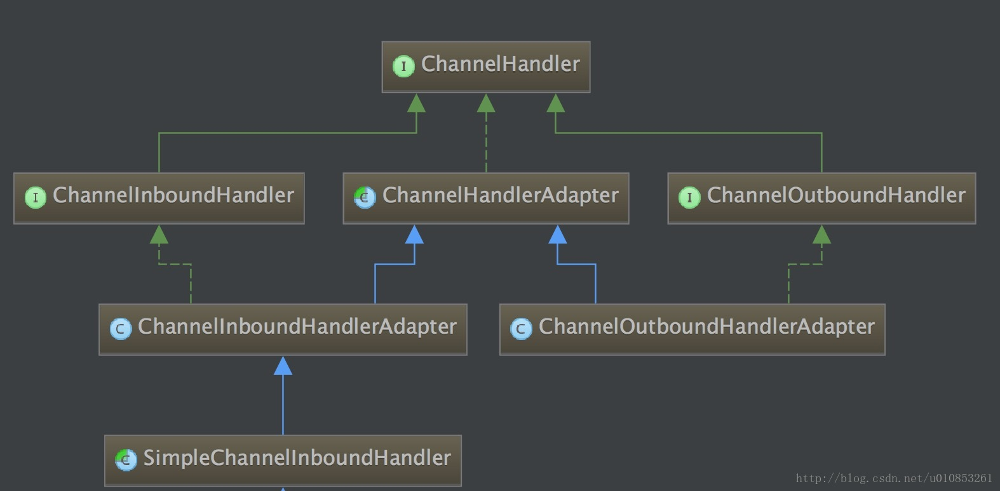

### EventLoop

### ByteBuf

Java NIO 提供了 ByteBuffer 用于数据传输，对于复杂的 NIO 编程，ByteBuffer 有几个缺点：
- ByteBuffer 长度固定，一旦分配完成容量就不能动态扩展和收缩，当需要编码的对象较大时容易出现索引越界异常
- ByteBuffer 只有一个标识位置的指针 position，读写的时候需要手动调用 flip 和 rewind 等方法

Netty 实现了 ByteBuf 在提供与 ByteBuffer 功能基本一致的基础上增加了新的功能。ByteBuf 通过两个位置指针 readInex 和 writeIndex 来协助处理缓冲区的读写操作，readIndex 和 writeIndex 的初始位置是 0，数据写入 ByteBuf 时 writeIndex 会增加，从 ByteBuf 写数据时 readIndex 会增加，但是不会超过 writeIndex。0-readIndex 之间的数据视为 discard 的，调用 discardReadBytes 方法可以释放这部分空间。readIndex 和 writeIndex 之间的数据是可读的，writeIndex 和 capacity 之间的空间是可写的。

由于不需要写操作不会修改 readIndex，读操作不会修改 writeIndex，因此 ByteBuf 的读写操作是独立的。

```
       +-------------------+------------------+------------------+
       | discardable bytes |  readable bytes  |  writable bytes  |
       |                   |     (CONTENT)    |                  |
       +-------------------+------------------+------------------+
       |                   |                  |                  |
       0      <=      readerIndex   <=   writerIndex    <=    capacity

```

通常情况下 ByteBuffer 进行 put 的时候，如果空间不足以写入就会发生 BufferOverflowException 异常，为了避免异常发生需要在 put 之前使用 remaining 方法判断可以空间是否足够，如果不足需要重新分配内存并复制数据。Netty 提供的 ByteBuf 对这个操作进行了封装，也就是对空间的校验在 ByteBuf 中完成，使用时不必担心空间问题。
```java
public ByteBuf writeBytes(byte[] src, int srcIndex, int length) {
    // 确保空间足够
    ensureWritable(length);
    setBytes(writerIndex, src, srcIndex, length);
    writerIndex += length;
    return this;
}

```

Java NIO 的 Channel 读写是通过 ByteBuffer 完成的，因此 Netty 的 ByteBuf 必须能够转换成 ByteBuffer 或者将 ByteBuffer 转换成 ByteBuf，Netty 提供的 ByteBuf 提供了转换位 ByteBuffer 的方法：
- ```nioBuffer```：将当前 ByteBuf 可读的缓冲区转换成 ByteBuffer，两者共享同一个缓冲区内容引用，对 ByteBuffer 的读写操作不会影响 ByteBuf，ByteBuffer 无法感知 ByteBuf 的扩容


ByteBuf 有多个子类，从内存分配的角度可以分为两类：堆内存 ByteBuf 和 直接内存 ByteBuf；从内存回收角度也可以分为两类：池化 ByteBuf 和 非池化 ByteBuf。
- 堆内存 ByteBuf 使用堆内存分配缓冲区，内存的分配和释放由 JVM 管理，但是在和 Socket 进行 I/O 读写时需要额外做一次内存复制，即将堆内存从缓冲区复制到内核的 Channel 中
- 直接内存 ByteBuf 在对外进行内存分配，内存的分配和释放不被 JVM 管理，需要手动处理，在和 Socket 进行 I/O 读写时不需要额外的一次内存复制，但是手动管理有可能会造成内存泄漏

Netty 提供的多个 ByteBuf 可以针对不同的情况使用，最佳实践是在 I/O 通信线程的读写缓冲区使用 直接内存 ByteBuf，业务消息的编解码使用 堆内存 ByteBuf。

池化 ByteBuf 和 非池化 ByteBuf 主要区别就是池化 ByteBuf 会重用 ButeBuf 的内存区域，避免频繁的 GC。

### Chnnel

Channel 是 Netty 通信组件中用于执行网络 I/O 的组件，通过 Channel 可以获得当前连接的状态，通过 Channel 可以获取网络连接的配置参数。Channel 提供异步的网络操作，异步调用意味着任何的 IO 调用将立即返回，并且不保证在调用结束时所请求的 IO 操作已经完成。调用立即返回 ChannelFuture ，通过注册监听器到 ChannelFuture 可以在 IO 操作完成时调用回调函数。不同的协议对应的 Channel 类型是不同的。


### ChannelHandler

ChannelHandler 是一个用于处理 I/O 事件的接口，ChannelHandler 有多个实现类:



其中 ```ChannelInboundHandler``` 接口用于处理 inbound 事件，```ChannelOutbound``` 接口用于处理 outbound 事件，而 ```ChannelInboundHandlerAdapter``` 和 ```ChannelOutboundHandlerAdapter``` 两个实现类提供了接口的默认处理，实际应用中一般通过继承这两个实现类的方式自定义 Handler。


### ChannelFuture

### ChannelPipeline

Netty 中每个 Channel 都有一个 ChannelPipeline 与之对应，ChannelPipeline 中维护了一个由 ChannelHandlerContext 组成的双向链表，其中头节点是 HeadContext，尾节点是 TailContext，双向链表中的每个 ChannelHandlerContext 都关联一个 ChannelHandler。

当调用 ChannelPipeline 的 addLast 方法加入自定义的 ChannelHandler 时先将 ChannelHandler 包装成 ChannelHandlerContext 然后加入双向链表的尾部。

ChannelPipeline 中维护的 ChannelHandlerContext 双向链表完成了对 inbound 和 outbound 事件的拦截和处理，当调用 ```AbstractChannel#write``` 方法时会自动调用 ChannelPipeline 的 write 方法，由于 write 是 outbound 事件，ChannelPipeline 会直接找到 tail 节点并从尾节点开始向头节点开始查找 outbound 类型的 ContextHandler 并调用其中的 ChannelHandler 的方法；同理当是 inbound 事件时 ChannelPipeline 会从 head 开始向尾节点查找 inbound 类型的 ContextHandler 并执行其中的 ChannelHandler 的 write 方法。

### BootStrap