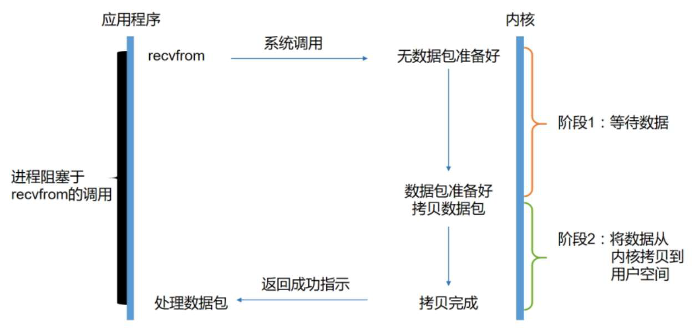
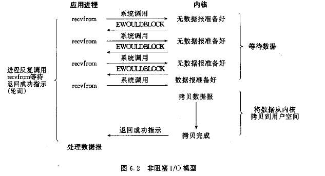
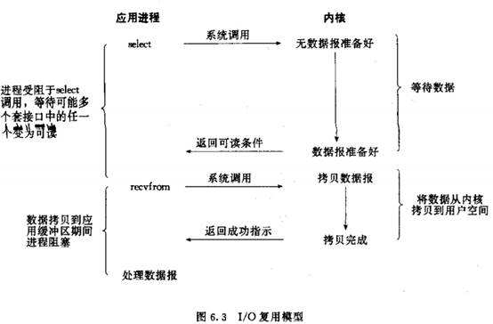
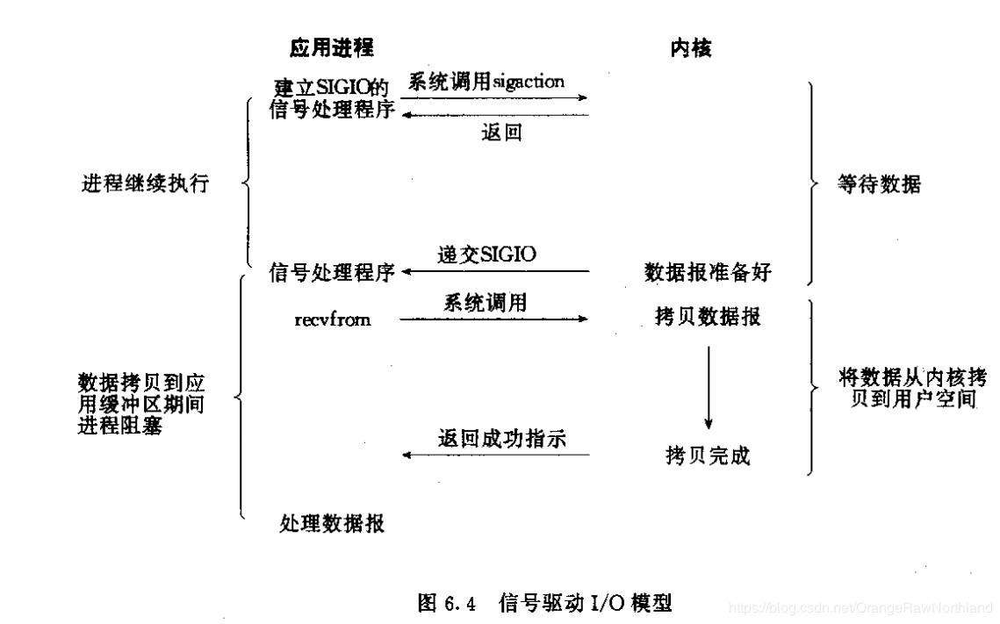

### I/O 模型

Linux 将所有的设备都看做文件，对文件的读写操作会调用内核提供的系统命令，返回一个文件描述符 (file descriptor, fd)，文件描述符是一个地址，指向内核中的一个存储了文件路径、数据区等属性的结构体。

操作系统的核心是内核，独立与普通的应用程序，可以访问受保护的内存空间，也有访问底层硬件设备的所有权限。现代操作系统都是采用虚拟存储器，为了保证用户进程不能直接操作内核，操作系统将虚拟空间划分为内核空间和用户空间。

操作系统为了限制进程的访问能力将 CPU 划分为**用户态**和**进程态**


#### 阻塞 I/O 模型

```sequence
应用进程->系统内核: recvfrom 系统调用
Note left of 应用进程: 进程阻塞 
系统内核->系统内核: 等待数据准备好
系统内核->系统内核: 将数据从内核空间拷贝到用户空间
系统内核->应用进程: 数据读取完成
```


应用进程发调用内核命令 `recvfrom` 发起系统调用，其系统调用直到数据包到达且被复制到应用进程的缓冲区中或者发生错误才返回，在此期间应用进程都是被阻塞的，因此称为阻塞 I/O 模型。



#### 非阻塞 I/O 模型

recvfrom 从应用层到内核的时候，如果缓冲区没有数据就直接返回 EWOULDBLOCK 错误，一般都对非阻塞 I/O 模型进行轮询检查这个状态，看内核是不是有数据到来，这个过程中应用进程并没有一直阻塞等待数据到来，因此称为非阻塞 I/O 模型 



#### I/O 复用模型

Linux 提供 select/poll，进程通过将一个或多个 fd 传递给 select 或 poll 系统调用，这样 select/poll 就可以侦测多路 fd 是否处于就绪状态，而进程只阻塞在 select 操作上。

select/poll 是顺序扫描 fd 是否就绪，而且支持的 fd 数量有限，当少量 fd 活跃时效率较低；Linux 提供了 epoll 系统调用，epoll 使用信号驱动方式代替顺序扫描，当 fd 就绪时立即调用回调函数 rollback，因此性能会更高。



#### 信号驱动 I/O 模型

首先开启套接口信号驱动 I/O 功能，并通过系统调用 sigaction 执行一个信号处理函数(此系统调用立即返回，进程继续工作，它是非阻塞的)，当数据准备就绪时，就为该进程生成一个 SIGIO 信号，通过信号回调通知应用程序调用 recvfrom 来读取数据。



#### 异步 I/O 模型


- **同步**
- **异步**
- **阻塞**
- **非阻塞**

### Java I/O

Java 在 1.4 之前支持支阻塞式 I/O，在 1.4 之后支持多路复用模型，在 1.7 之后支持异步 I/O 模型。

Java 阻塞式 io 是以流(Stream)的方式进行数据操作，多路复用模型使用通道(Channel)来进行数据操作，异步 io 则是使用异步通道(AsynchronousChannel) 进行数据操作。


```java
// 阻塞式 IO
InputStream in = new FileInputStream("file_name");
byte[] bytes = new byte[in.available()];
while(in.read(bytes) != -1){
    System.out.println(new String(bytes));
}

// 多路复用 IO
Channel chan = Channels.newChannel(new FileInputStream("file_name"));
ByteBuffer buf = ByteBuffer.allocate(1024);
channel.read(buf);

```


#### `BIO`

Java 传统 IO 操作是以流的形式进行，用户进程在读取或者写入数据时调用系统命令并传入文件描述符，如果数据没有拷贝到缓冲区则会一直阻塞。

##### `Stream`


#### `NIO`

##### `Channel`

##### `Buffer`

#### `AIO`

##### `AsynchronousChannel`

##### `Futures`

**[Back](../)**


http://www.52im.net/thread-306-1-1.html