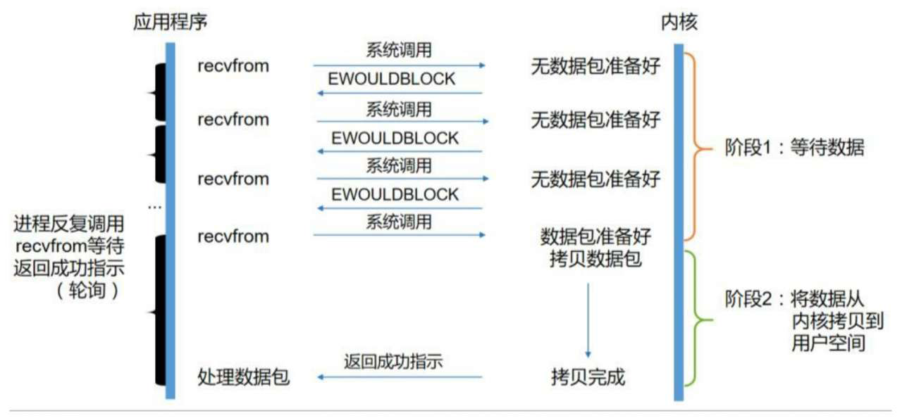

### I/O 模型

操作系统为了将内核和进程隔离开，将虚拟内存划分为**内核空间**和**用户空间**，其中系统内核运行在内核空间，用户进程运载用户空间，用户空间的进程不能直接访问内核空间，而需要通过系统调用(`system call`)。

操作系统利用 CPU 不同的运行级别将运行状态划分为**内核态**和**用户态**，其中内核运行在内核态，具有最高的权限，可以执行所有操作。运行在用户空间的进程通过系统调用访问内核空间时，需要由内核完成内核空间的访问，此时 CPU 需要从用户态切换到内核态，此时需要保存用户空间的参数。

Linux 将所有的设备都看做文件，进程的 I/O 是通过操作调用系统命令返回文件描述符 (file descriptor, fd）来完成。进程在发起系统调用后，内核会先查看缓冲区中是否有数据，如果没有就会从 I/O 设备中读取，然后将数据复制到用户空间，因此整个 I/O 过程分为两步：

- 从 I/O 设备读取数据到缓冲区，通常为 ms 级
- 将缓冲区中的数据复制到用户进程

想要提高 I/O 效率，则需要降低等待时间，Unix 根据不同的实现划分为 5 中 I/O 模型：阻塞 I/O、非阻塞 I/O、多路复用 I/O 和异步 I/O。


#### 阻塞 I/O 模型

应用进程发起 `recvfrom` 系统调用，其系统调用直到数据包到达且被复制到应用进程的缓冲区中或者发生错误才返回，在此期间应用进程都是被阻塞的，因此称为阻塞 I/O 模型。


#### 非阻塞 I/O 模型

应用进程发起 `recvfrom` 系统调用后，如果缓冲区没有数据就直接返回 `EWOULDBLOCK` 错误，一般都对非阻塞 I/O 模型进行轮询检查这个状态，看内核是不是有数据到来，这个过程中应用进程并没有一直阻塞等待数据到来，因此称为非阻塞 I/O 模型 。

非阻塞模型需要不断的轮询系统调用，使得进程不断的在用户态和内核态切换，影响 CPU 的性能。



#### I/O 复用模型

应用进程将文件描述符(fd)传递给 `select` 系统调用，通过操作系统的 `select` 侦测多路 fd 是否处于就绪状态，然后调用 `recvfrom` 系统命令读取就绪的数据包。

Linux 提供了 epoll 系统调用代替 `select`，epoll 使用信号驱动方式代替顺序扫描，当 fd 就绪时立即调用回调函数 rollback，因此性能会更高。

多路复用模型并没有减少进程的等待时间，但是由于 `select` 可以侦测多路 fd，在需要大量 I/O 操作时减少了进程间的切换。


#### 信号驱动 I/O 模型

信号驱动模型通过系统调用` sigaction` 向内核注册信号处理函数，此系统调用立即返回，进程继续工作，它是非阻塞的。当数据准备就绪时，就为该进程生成一个 SIGIO 信号，通过信号回调通知应用程序调用 recvfrom 来读取数据。


#### 异步 I/O 模型

应用进程发起 `aio_read` 系统调用后直接返回，内核在将数据拷贝到用户空间后发送指定的信号


- **同步**
- **异步**
- **阻塞**
- **非阻塞**

### Java I/O

Java 在 1.4 之前支持支阻塞式 I/O，在 1.4 之后支持多路复用模型，在 1.7 之后支持异步 I/O 模型。

Java 阻塞式 io 是以流(Stream)的方式进行数据操作，多路复用模型使用通道(Channel)来进行数据操作，异步 io 则是使用异步通道(AsynchronousChannel) 进行数据操作。


```java
// 阻塞式 IO
InputStream in = new FileInputStream("file_name");
byte[] bytes = new byte[in.available()];
while(in.read(bytes) != -1){
    System.out.println(new String(bytes));
}

// 多路复用 IO
Channel chan = Channels.newChannel(new FileInputStream("file_name"));
ByteBuffer buf = ByteBuffer.allocate(1024);
channel.read(buf);

```


#### `BIO`

Java 传统 IO 操作是以流的形式进行，用户进程在读取或者写入数据时调用系统命令并传入文件描述符，如果数据没有拷贝到缓冲区则会一直阻塞。

##### `Stream`


#### `NIO`

##### `Channel`

##### `Buffer`

Buffer 是一个存储特定基础类型数据的容器，其实质是特定基础类型元素的线性有限序列。Buffer  定义了三个基本属性：

- `capacity`：Buffer 的容量，在创建 Buffer 的时候需要指定 capacity，容量大小不为负数且一旦指定后就不允许修改，Buffer 中存储的元素数量不能超过 Buffer 的容量
- `limit`：Buffer 中第一个不能读取或者写入的元素的下标，即当前 Buffer 中存储的数据的最大长度，`limit` 的值不能为负数且永远不会大于 `capacity`，Buffer 初始化时 `limit` 初始化为 `capacity` 大小
- `position`：Buffer 中下一个将要被读取或者写入的元素的下标，`position` 不能为负数且永远不会大于 `limit`

```java
// 获取 buffer 的 position
buffer.position();
// 获取 buffer 的 limit
buffer.limit();
// 获取 buffer 的 capacity
buffer.capacity();
```

Buffer 是 NIO 双工模式中用于存储数据的载体，可以同时进行读写。Buffer 的每次读写操作使得 position 增加直到达到 limit，此后再次读取数据则会抛出 `BufferUnderflowException`，再次写入数据则会抛出 `BufferOverflowException`。

`Buffer` 提供 `mark` 属性表示 `reset` 方法调用后 position 重置的索引，`mark` 如果定义了则必须是正数且永远不会大于` position`，如果 `position` 或者 `limit` 重新调整为小于 `mark` 的值则会丢弃 `mark`，如果 `mark` 未定义则调用 `reset` 方法时会抛出 `InvalidMarkException`。

```java
// position 设置为 mark
// 如果 mark 未设置(-1) 则抛出异常
buffer.reset();

buffer.mark();
```

0 <= mark <= position <= limit <= capacity


```java
// limit 设置为 position
// position 设置为 0
// mark 设置为 -1
buffer.flip();

```

ByteBuffer 是 Buffer 常用的实现类，其有堆内分配和对外分配两种方式，使用 ```ByteBuffer#allocate``` 方法返回的是堆内分配的 ByteBuffer，使用 ```ByteBuffer#allocateDirect``` 方法返回的是堆外分配的 ByteBuffer。

#### `AIO`

##### `AsynchronousChannel`


#### 零拷贝

操作系统处理网络数据有两个阶段：等待数据和拷贝数据。等待数据是系统内核等待网卡接收到数据并写入到内核中，拷贝数据就是将内核中的数据拷贝到应用进程的空间中。


应用进程的每一次写操作都会把数据写到用户空间的缓冲区中，再由 CPU 将数据拷贝到系统内核的缓冲区中，之后再由 DMA 将数据拷贝到网卡中，最后由网卡发送出去。

应用程序的读操作则需要先由 DMA 将数据从网卡拷贝到内核缓冲区，然后由 CPU 将数据拷贝到用户空间的缓冲区，之后应用进程才能读取到数据。

应用进程的一次完整的读写操作需要在用户空间和内核空间进行数据拷贝，并需要 CPU 在用户空间和内核空间之间切换，通过零拷贝的方式可以减少数据的拷贝以及用户空间和内核空间的切换。

零拷贝(Zero-copy)技术就是取消用户空间和内核空间之间的数据拷贝，应用进程的读写操作如同直接写入内核空间一样从而无需进行数据拷贝。零拷贝有两种实现方式：mmap+write 方式和 sendfile 方式。


传统网络 IO 分析：
```java
read(file, tmp_buf, len)
write(socket, tmp_buf, len)
```
- 程序使用 read 方法，系统由用户态切换为内核态，磁盘中的数据由 DMA(Direct Memory Access) 方式读取到内核缓冲区(kernel buffer)，DMA 过程中不需要 CPU 参与，而是 DMA 处理器直接将硬盘的数据通过总线传输到内存中
- 系统由内核态切换为用户态，应用程序从内核缓冲区写入用户缓冲区，这个过程需要 CPU 参与
- 程序使用 write 方法，系统由用户态切换为内核态，数据从用户缓冲区写入到网络缓冲区(socket buffer)，这个过程需要 CPU 参与
- 系统由内核态切换到用户态，网络缓冲区的数据通过 DMA 的方式传输到网卡驱动中

内存映射(MMAP) 方式 IO 分析：
```java
tmp_buf = mmap(file, len);
write(socket, tmp_buf, len);
```
MMAP 原理是将用户缓冲区的内存地址和内核缓冲区的地址做一个映射，也就是说在用户态可以直接读取并操作内核空间数据。

- 程序使用 mmap 方法，系统由用户态切换到内核态，采用 DMA 方式将磁盘的数据读取到内核缓冲区
- 系统由内核态切换为用户态，由于用户缓冲区和内核缓冲区有映射，所以不需要消耗 CPU 将内核缓冲区数据拷贝到用户缓冲区
- 程序使用 write 方法，系统由用户态切换为内核态，需要使用 CPU 将内核缓冲区的数据拷贝到网络缓冲区中
- 系统由内核态切换为用户态，网络缓冲区的数据通过 DMA 方式传输到网卡驱动中

使用 MMAP 技术减少了一次数据拷贝，并没有减少上下文切换次数，在多线程操作同一块内存映射时需要采用并发编程的技术保证数据一致性。

sendfile 方式 IO 分析：
```java
snedfile(socket, file, len)
```
- sendfile 调用会引起系统由用户态切换到内核态，磁盘数据通过 DMA 方式读取到内核缓冲区
- 系统依然在内核态，内核缓冲区中的数据通过 CPU 拷贝到网络缓冲区
- 系统由内核态切换到用户态，并使用 DMA 将网络缓冲区的数据发送到网卡驱动


Java 中常用的零拷贝有 mmap（内存映射）和 sendFile。 mmap 通过内存映射，将文件映射到内核缓冲区，用户空间和内核空间可以共享内核空间的数据，减少用户空间到内核空间的数据拷贝(4 次减少到 3 次)。sendFile 是数据不经过用户态，直接从内核缓冲区进入到 SocketBuffer，在减少数据拷贝的同时也减少了状态上下文切换。

mmap 适合小数据量读写，sendFile 适合大文件传输；mmap 需要 4 次上下文切换，3 次数据拷贝，sendFile 需要 3 次上下文切换，最少 2 次数据拷贝；sendFile 可以利用 DMA 方式，减少 CPU 拷贝， mmap 则不能，必须从内核拷贝到 socket 缓冲区


**[Back](../)**


http://www.52im.net/thread-306-1-1.html