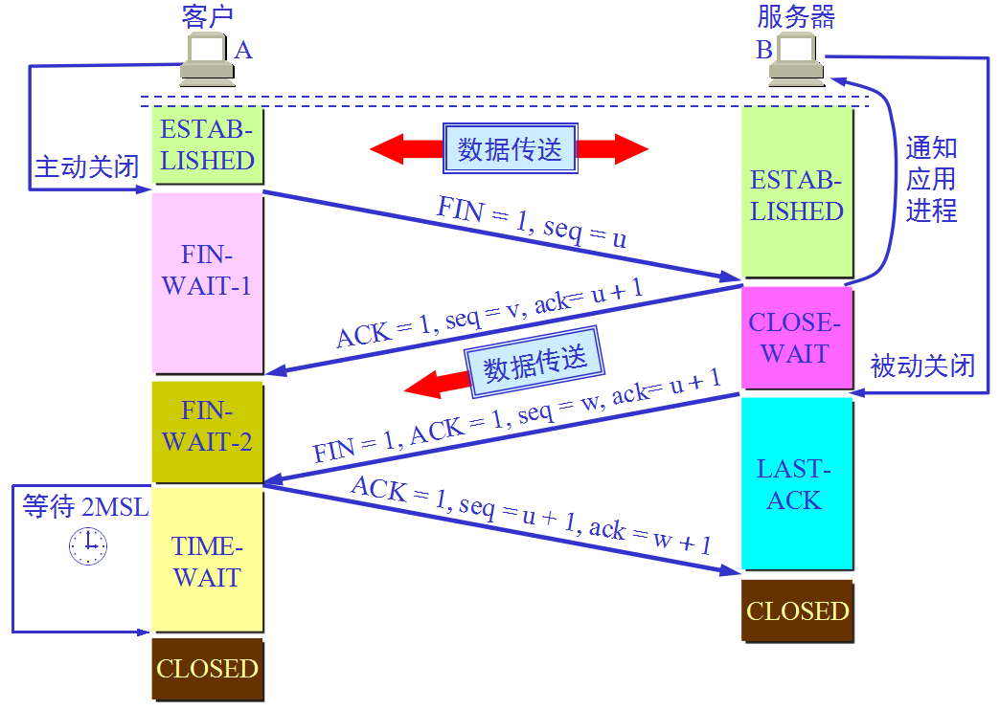

## 网络协议

为进行网络中的数据交换而建立的规则、标准或约定称为网络协议(network protocol)。对于复杂的网络协议，其结构是层次式的，各层及其协议的集合称为网络的体系结构。

OSI 七层体系结构将整个网络协议分为七层：物理层、数据链路层、网络层、传输层、会话层、表示层、应用层。
- 应用层：体系结构的最高层，定义的是应用进程间通信和交互的规则，传输的数据单元称为报文(message)
- 传输层：负责向两个主机中进程之间的通信提供通用的数据传输服务。传输层主要使用 TCP(Transmission Control Protocol) 和 UDP(User Datagram Protocol) 两种协议，其中 TCP 协议提供面向连接的、可靠的数据传输服务，数据传输的单位是 **报文段**；UDP 协议提供无连接的、**尽最大努力**的数据传输服务(不保证数据的可靠性)，数据传输的单位是用户数据报
- 网络层：网络层负责为分组交换网上的不同主机提供通信服务，发送数据时将运输层产生的报文段或用户数据报分组或包进行传输。网络层需要选择合适的路由，使源主机运输层的分组能够通过网络中的路由器找到目的主机
- 数据链路层：数据链路层将网络层的 IP 数据报组装成帧(framing)，在两个相邻结点间的链路上传送帧(frame)
- 物理层：物理层上传输的数据是比特(bit)，物理层不需要关注比特的解释，只需要关注如何将电压转换为比特

TCP/IP 四层体系将 OSI 七层模型简化为四层：链路层、网络层、传输层、应用层。
- 链路层：对应七层协议的物理层和数据链路层
- 网络层：对应七层协议的网络层
- 传输层：对应七层网络协议的传输层
- 应用层：对应七层网络协议的会话层、表示层和应用层


### TCP 协议

传输控制协议(TCP, Transmission Control Protocol) 是一种面向连接的、可靠的、基于字节流的、点对点的通信协议。

- **面向连接**：TCP 协议要求端点进行通信前必须建立 TCP 连接，数据传输完之后需要释放 TCP 连接
- **可靠的**：TCP 协议要求数据传输是可靠的，即无差错、不丢失、不重复并且按序到达，通过停止等待和重试机制保证消息传输可靠
- **基于字节流**：TCP 协议传输的数据是字节流，因此会出现拆包和粘包的问题，需要上层协议处理
- **点对点**：TCP 协议要求通信必须是端对端的传输，即不支持广播和多播


TCP 提供全双工通信，TCP 连接两端都设有发送缓冲和接收缓冲，在发送时应用程序的数据发送到缓冲后，TCP 在合适的时候将数据发送出去，在接收时数据存储在缓冲中，应用程序在合适的时候读取缓冲区的数据

TCP 连接的端点叫做套接字(Socket)，由 IP 地址和端口号定义，每一条 TCP 连接唯一的被通信两端的两个端点所确定。

#### 可靠传输

IP 协议只能提供尽最大努力传输数据，也就是不可靠的，因此 TCP 必须采用适当的措施保证通信变得可靠。TCP 协议通过停止等待和超时重传机制保证消息的可靠性。

**超时重传**指的是发送方发送数据后需要等待接收方的确认响应，如果超过一定时间后没有收到确认则会重传之前的数据。超时重传需要设置一个定时器，定时器的超时时间必须比数据传输往返时间更长，超时重传需要缓存已发送但未收到确认的数据副本以及其编号用于重传。

- 如果由于网络问题可能会导致接收方返回确认响应但是发送方并未接收，此时发送方在超时后会重传数据，接收方在接收到重复的数据后会直接丢弃数据并向发送方返回接收确认；
- 如果由于网络延时导致发送方在重传数据后才收到上次的确认响应，此时发送方会接收到两次确认响应，发送方会直接丢弃重复的确认响应

超时重传机制能够保证数据不丢失、不重复，但是超时重传机制不能保证数据按序到达，这个问题需要停止等待机制解决。

**停止等待**指的是发送方在传输完一个分组数据并接收到确认响应之后再发送下一个分组数据。这种传输方式信道利用率较低，可以将停止等待过程改为流水线传输形式，即发送方发送完一个分组数据后不必等待确认响应而是继续发送下一个分组数据，这样使得信道上一直有数据传输，提高信道利用率。

流水线发送数据使用窗口来保证数据有序，窗口内分组数据可以发送，发送方每接收到一个确认响应就会滑动对应的位置，对于乱序到达的数据并不会导致窗口滑动。接收方一般采用累计确认的方式，即在收到几个分组数据之后才返回确认响应，表示在这之前的数据都已经正确接收。

#### TCP 可靠传输协议实现

TCP 的滑动窗口是以字节为单位的，在没有收到接收确认的情况下，发送者可以将滑动窗口中的数据都发送出去。发送窗口里面的序号表示允许发送的序号，窗口越大，发送方就可以在接收方确认之前连续发送越多的数据，从而获得越高的传输效率。

发送窗口的后沿的后面部分表示已经发送且收到的确认，发送窗口的前沿前面的部分表示不允许发送的，因为接收方没有为这部分数据保留临时缓存空间。发送窗口的后沿只有前移和不动两种可能，而前沿也有可能前移和不动两种可能。

后沿前移是收到了接收者的确认，前沿的不动可能是收到了确认但接收者通知的窗口缩小了使得发送窗口的前沿正好不动。

```
  +----------------+-----------------+-----------------+---------------+
  |  已经发送确认  |  尚未确认的数据  |  可以发送的数据  | 不能发送的数据 |
  +----------------+-----------------+-----------------+---------------+
                P1               P2              P3
```
发送窗口需要三个指针描述状态，指针都指向字节的序号：
- 小于 P1 的是已经发送并已收到确认的部分
- 大于 P3 的是不允许发送的部分
- P3-P1 是发送窗口大小
- P2-P1 是已经发送但尚未收到确认的字节数
- P3-P2 是允许发送但尚未发送的字节数

接收窗口后沿后面的是已经发送过确认的数据，窗口内的序号是允许接收的，接收方只能对按序接收的数据中的最高序号给出确认。接收方在返回确认之前还会返回可以接收的窗口大小，发送方需要根据大小调整发送窗口，当发送窗口内的数据全部发送但未收到确认就需要等待直到收到确认或者超时重试。

发送方的应用进程把字节流写入 TCP 的发送缓存，接收方的应用进程从 TCP 的接收缓存中读取字节流。缓存空间是循环使用的，且缓存空间的大小一般比滑动窗口大。

发送缓存用来存放发送应用程序传送给发送方 TCP 准备发送的数据 和 TCP 已经发送出但尚未接收到确认的数据。发送窗口通常只是发送缓存的一部分，已经确认的数据应当从发送缓存中删除，因此发送缓存和发送窗口的后沿是重合的。发送应用程序最后写入发送缓存的字节减去最后被确认的字节即使还保留在发送缓存中的被写入的字节数，发送应用程序必须控制写入缓存的速率，否则发送缓存就会没有存放数据的空间。

接收缓存用来存放按序到达的、尚未被接收应用程序读取的数据 和 未按序到达的数据。如果接收应用程序来不及读取收到的数据，接收缓存就会被填满，使接收窗口减小到零。


TCP 的发送方在规定的时间内没有收到确认就要重传已发送的报文段，超时时间设置的太短会引起不必要的报文段重传，而超时时间设置的太长会使得网络空闲时间太长降低传输效率。TCP 采用了一种自适应算法，记录每个报文段的发送到接收到确认的时间间隔 RTT，TCP 保留了 RTT 的一个加权平均往返时间 RTTs，其计算方式为 ```RTTs = (1-a)*RTTs + a*RTT```，a 一般取值 0.125。TCP 的超时重试时间(RTO, RetransmissionTimeOut) 应略大于 RTTs，其计算方式为 ```RTO = RTTs + RTTd```，其中 RTTd 是 RTT 的偏差加权平均值，计算方式为 ```RTTd = (1-b)*RTTd + b * |RTTs - RTT|```，b 一般取值 0.25。当发生数据报文重传时，报文段每重传一次就把超时重传时间 RTO 增加为之前的 2 倍，直到没有发生重传时才按照公式计算重传时间。

#### 流量控制

流量控制就是让发送方的发送速率不要太快从而使接收方能够来得及接收，TCP 的流量控制时基于滑动窗口实现的。

发送方与接收方建立连接后接收方在确认时会返回接收窗口大小，发送方的发送窗口不能超过接收方给出的接收窗口的数据。TCP 的窗口单位是字节，不是报文段。

当接收方处理速度较慢导致接收缓存满了就会返回零窗口确认响应，此时发送方的发送窗口需要调整为 0，当接收方可以处理数据是会给发送方发送非零窗口通知，为了防止发送方没有收到接收方返回的非零窗口通知，TCP 为每个连接设有一个持续计时器，只要 TCP 连接的一方收到对方的零窗口通知，就启动持续计时器，若持续计时器设置的时间到期，就发送一个零窗口探测报文段，而对方就在确认这个探测报文段时给出了现在的窗口值，如果窗口仍然是 0 那么收到这个报文段的一方就重新设置持续计时器，如果不是 0 那么就可以继续发送数据了。

TCP 可以用不同的机制来控制报文段发送的时机，TCP 实现中广泛使用 Nagle 算法：若发送应用进程把要发送的数据逐个字节地发送到 TCP 的发送缓存，则发送方就把第一个数据字节先发送出去，把后面到达的数据字节都缓存起来，当发送方接收到对第一个数据字符的确认后，再把发送缓存中的所有数据组装成一个报文段发送出去，同时继续对随后到达的数据进行缓存，只有在收到对前一个报文段的确认后才继续发送下一个报文段，当数据到达较快而网络速率较慢时，用这样的方法可以明显地减少所用的网络带宽。Nagle 算法规定当到达的数据已达到发送窗口大小的一半或以达到报文段的最大长度时，就立即发送一个报文段，这样可以有效地提高网络的吞吐量。


#### 拥塞控制

在计算机网络中的带宽、交换节点中的患处和处理及等，都是网络的资源，当对网络中某一资源的需求超过了该资源所能提供的可用部分，网络性能就会变坏，这种情况叫做拥塞。

拥塞控制与流量控制相关，拥塞控制就是防止过多的数据注入到网络中，这样可以使网络中的路由器或链路不致过载。

拥塞控制是一个全局性的过程，涉及到降低网络传输性能有关的所有因素；流量控制往往指点对点通信量的控制，是端到端的问题，流量控制所要做的就是抑制发送端发送数据的速率，以便使接收端来得及接收。

拥塞控制有四种算法：慢开始、拥塞避免、快重传 和 快恢复。发送方维持一个拥塞窗口 cwnd 的状态变量，拥塞窗口的大小取决于网络的拥塞程度，并且动态的变化，发送方让自己的发送窗口大小等于或者小于拥塞窗口。

发送方控制拥塞窗口的原则是：只要网络没有出现拥塞就把拥塞窗口增大些以便把更多的分组发送出去，只要网络出现了拥塞，拥塞窗口就减小一些，以减少注入到网络中的分组数。只要发送方没有按时接收到接收方的确认报文，就认为网络出现了拥塞。

**慢开始算法**原理是当主机开始发送数据时，由小到大逐渐增大发送窗，即逐渐增大拥塞窗口，通常在刚开始发送报文时拥塞窗口 cwnd 设置为一个报文段 MSS(最大报文段长度) 的数值，在每收到一个对新的报文段的确认后，把拥塞窗口增加一个 MSS 数值。

为了防止拥塞窗口 cwnd 增长过大引起网络拥塞，需要设置慢开始门限 ssthresh 状态变量，当 cwnd < ssthresh 时，使用慢开始算法，当 cwnd > ssthresh 时停止使用慢开始算法而改用拥塞避免算法。

**拥塞避免算法**的思路是让拥塞窗口 cwnd 缓慢地增大，即每经过一个往返时间 RTT 就把发送方地拥塞窗口 cwnd 增加 1，这样拥塞窗口 cwnd 按线性规律缓慢增长(加法增大)。

无论在慢开始阶段还是在拥塞避免阶段，只要发送方判断网络出现了拥塞(没有按时接收到确认)，就要把慢开始门限 ssthresh 设置为出现拥塞时发送方窗口值的一半(乘法减小)，然后把拥塞窗口 cwnd 重新设置为 1，执行慢开始算法，这样可以迅速减少主机发送到网络中地分组数，使得发生拥塞地路由器有足够地时间把积压在队列中地分组处理完毕。

**快重传算法**首先要求接收方每收到一个失序地报文段后就立即发出重复确认，如接收方收到了 M1 和 M2 后都分别发出了确认，但是在接收 M4 之前没有接收到 M3，此时快重传算法规定接收方需要及时发送对 M2 的重复确认，这样可以让发送方及早直到报文段 M3 没有到达接收方。接着发送方发送 M5 和 M6，接收方接收后也都需要及时返回对 M2 的重复确认。快重传算法规定，发送方只要一连收到三个重复确认就应当立即重传对方尚未收到的报文段 M3，而不必等待为 M3 设置的重传计时器到期。由于发送方能尽早重传未被确认的报文段，因此采用快重传后可以使整个网络的吞吐量提升 20%。

**快恢复算法有**两个要点：
- 当发送方连续收到三个重复确认时，就把慢开始门限 sshtresh 减半，这是为了预防网络发生拥塞，但之后并不执行慢开始算法
- 发送方现在认为网络很可能没有发生网络阻塞(连续几个报文段都发送到接收方并返回重复确认)，因此不执行慢开始算法(拥塞窗口 cwnd 不设置为 1)，而是把 cwnd 值设置为慢开始门限 sshtresh 减半后的值，然后开始执行拥塞避免算法(加法增大)，使拥塞窗口缓慢的线性增大。


接收方的缓存空间时有限的，接收方根据自己的接收能力设定了接收窗口 rwnd 并把这个窗口值写入 TCP 首部中的窗口字段传送给发送方，从接收方对发送方的流量控制角度考虑，发送方的发送窗口一定不能超过接收方的接收窗口值。

发送窗口的上限应当为接收方窗口 rwnd 和 网络拥塞窗口 cwnd 这两个中较小的一个。

#### TCP 连接管理
TCP 是面向连接的协议，TCP 连接的建立和释放是每一次面向连接的通信中必不可少的过程。


Server 打开服务之后处于 LISTEN 状态等待 Client 的连接请求。

- Client 发送连接请求报文段，首部中同步位 SYN=1，同时选择一个初始序列号 seq=x。TCP 规定 SYN 报文段(SYN=1 的报文段)不能携带数据，但要消耗一个序号，此时客户端进入同步已发送(SYN-SENT) 状态
- Server 接收到连接请求报文段后，如果同意连接则需要向 Client 发送确认。确认报文段中 SYN 位和 ACK 位都置为 1，确认号是 ack=x+1，同时自己选择一个初始序号 seq=y，这个报文段也不能携带数据，但也需要消耗一个序列号。Server 进程进入同步收到(SYN-RCVD)状态
- Client 接收到确认后需要向 Server 发送确认，确认报文的 ACK 置 1，序列号 seq=x+1，ACK 报文段可以携带数据，如果不携带数据则不消耗序列号，Client 进入连接建立(ESTABLISHED)状态，当 Server 接收到 Client 的确认后也进入 ESTABLISED 状态。

三次握手中 Client 需要再次向 Client 发送确认是为了防止已失效的连接请求报文段突然又传送到了 Server，因而产生错误。已失效的连接是由于连接请求报文并没有丢失而是在网络节点长时间滞留导致连接已经释放之后才到达，此时 Server 以为是新的连接，如果直接建立连接发送确认给 Client 会被直接丢弃，此时 Server 会白白等待数据发送浪费资源。




数据传输结束后，通信的双方都可以释放连接，A 和 B 都处于 ESTABLISHED 状态，A 的应用进程向其 TCP 发出连接释放报文段，并停止再发送数据，主动关闭 TCP 连接。

- A 的释放连接报文段首部终止控制位 FIN 置为 1，序列号 seq=u 表示前面已经传送过的数据的最后一个字节序列号 + 1，这时 A 进入 FIN-WAIT-1 状态，等待 B 的确认。TCP 规定，FIN 报文段即使不携带数据也消耗一个序号。
- B 收到连接释放报文段后即发出确认，确认号是 ack=u+1，报文自己的序列号 seq=v，等于 B 前面已经传送的数据的最后一个字节的序号 + 1。B 进入 CLOSE-WAIT 状态，TCP 服务器进程这时应通知高层应用进程，因而从 A 到 B 这个方向的连接就释放了，这时 TCP 连接处于半释放状态，即 A 已经没有数据要发送了，但 B 若发送数据 A 仍要接收，也就是 B 到 A 方向的连接并未关闭。
- A 收到来自 B 的确认后，就进入 FIN-WAIT-2 状态，等待 B 发出的连接释放报文段。若 B 已经没有要向 A 发送的数据，其应用进程就通知 TCP 释放连接，这时 B 发出的释放连接报文段必须使 FIN=1，B 报文的序列号是 w，B 还必须重复上次已经发送过的确认号 ack=u+1，这时 B 就进入 LAST-ACK 状态，等待 A 的确认。
- A 在收到 B 的连接释放报文段后，必须对此发出确认，在确认报文中把  ACK 置 1，确认号 ack=w+1，而自己的需要是 seq=u+1(根据 TCP 标准，前面发送的 FIN 报文段要消耗一个序号)，然后进入 TIME-WATI 状态，现在 TCP 连接还并未释放掉，必须经过时间等待计时器(TIME-WAIT timer)设置的时间 2MSL 后，A 才进入到 CLOSED 状态，时间 MSL 叫做最长报文段寿命(Maxing Segment Lifgtime)。

A 在 TIME-WAIT 状态必须等待 2MSL 时间主要有两个理由：
- 保证 A 发送的最后一个 ACK 报文段能够到达 B，这个 ACK 报文有可能丢失，因而使处在 LAST-ACK 状态的 B 不能对已发送的 FIN+ACK 报文段的确认，B 会超时重传这个 FIN_ACK 报文段，而 A 就能在 2MSL 时间内收到这个重传的 FIN+ACK 报文段。如果 A 不等待就直接释放连接，那么就无法收到 B 重传的 FIN-ACK 报文段，因而也就不会再次发送一次确认报文段，这样 B 就无法按照正常步骤进入 CLOSED 状态。
- 防止已丢失的连接请求报文段出现在本次连接中。A 发送完最后一个 ACK 报文段后再经过 2MSL 时间就可以使本连接持续的时间内所产生的所有报文段都从网络中消失，这样可以使下一个新的连接中不会出现着这种旧的连接请求报文段。MSL 是指报文段在网络中最大的存活时间，如果经过 2MSL 时间内都没有接收到 B 重传的 FIN 则表示 A 返回的 ACK 已经被成功接收，此时可以关闭 TCP 连接

B 只要收到了 A 发出的确认就进入 CLOSED 状态，B 结束 TCP 连接的时间比 A 早些。

除时间等待计时器外，TCP 还设有一个保活计时器(keepalive timer)，服务器每收到一次客户的数据，就重新设置保活计时器，时间的设置通常是 2 小时，若计时器时间内没有收到客户端的数据，服务器就发送一个探测报文，以后则每隔 75 分钟发送一次，若连续 10 个探测报文后仍无客户端响应，则服务器认为客户端出现故障，接着就关闭连接。


### UDP 协议

可靠 udp 协议

### HTTP 协议

超文本传输协议(HyperText Transfer Protocol，HTTP) 是一种**应用层协议**，HTTP 协议是万维网的数据通信基础。

HTTP 协议采用了请求/响应模型，客户端向服务器发送一个请求报文，请求报文包含请求的方法、URL、协议版本、请求头和请求数据，服务器以一个状态行作为响应，响应的内容包括协议的版本、状态码、服务器信息、响应头和响应数据。

- HTTP 协议是基于请求-响应模式的，也就是说服务器端在没有接收到客户端发出的请求之前不会发送响应
- HTTP 协议是无状态的协议，即 HTTP 协议自身不对请求和响应之间的通信状态进行保存，HTTP1.1 增加了 Cookie 管理状态
- HTTP 协议是无连接的，即每次连接只处理一个请求，服务器处理完客户端的请求并收到客户端的应答后即断开连接，HTTP1.1 增加了 keep-alive 可以时服务端在返回响应之后保持连接一段时间

#### 请求方法

HTTP/1.1 协议中共定义了八种方法来操作指定的资源：
- GET：GET 应该只用于读取数据，而不应当被用于产生“副作用”的操作中
- HEAD：不返回资源本身，而是返回资源的元数据信息
- POST：向指定资源提交数据，请求服务器处理，可能会创建新的资源或修改现有的资源
- PUT：向指定资源位置上传最新内容
- DELETE：删除指定位置的资源
- TRACE：回显服务器收到的请求，主要用于测试或诊断
- OPTIONS：使服务器传回该资源所支持的所有 HTTP 请求方法
- CONNECT：用于 SSL 加密服务器的连接

#### 状态码

HTTP 响应的第一行是状态行，依次是 HTTP 版本号、状态码、状态描述，彼此使用空格分隔。

HTTP 响应的状态分为 5 类：
- 1xx：信息性状态码，表示接收的请求正在处理
- 2xx：成功状态码，表示请求处理完成
- 3xx：重定向状态码，表示资源已经被移动，客户端需要到新的资源地址获取
- 4xx：客户端错误状态码，表示服务器无法处理请求
- 5xx：服务器错误状态买，表示服务器处理请求出错

常见的状态码解释：
- 200：服务器成功处理了请求
- 301：资源被**永久**移除到其他位置，响应中需要包含资源新的地址
- 302：资源被**临时**移除到其他位置，响应中需要包含资源新的地址
- 304：表示客户端缓存的资源是最新的，客户端使用缓存即可。客户端在发送请求时将缓存中资源的最后修改时间发送给服务器端，服务器端如果发现资源未被修改则返回 304，否则返回 200 以及最新的资源
- 400：请求数据错误
- 403：请求被服务器拒绝
- 404：请求的资源未找到
- 500：服务器错误使其无法为请求提供服务
- 501：客户端发起的请求超出了服务器的能力范围

#### HTTP 请求和响应

HTTP 请求分为三部分：请求方法、地址和协议版本，请求头，请求体：
```
# 方法、地址、协议版本
POST /test HTTP/1.1
# 请求头
Host: ip
Connection: keep-alive
Content-Type: application/json

# 请求体
name=value
```

HTTP 响应分为三部分：协议版本、状态吗，响应头，响应体：
```
HTTP/1.1 200 OK
Content-Type: text/html

<html>
...
```

常见的请求头：
- Host: ip:port             # 目的主机和端口
- Connection: keep-alive    # 保持连接
- Content-Length: 68        # 消息体的长度
- Accept: application/json, text/html, */* # 客户端接收的响应数据类型
- Content-Type: application/json    # 请求数据的类型

常见的响应头：
- Content-Type: application/json    # 服务端接收的类型


**[Back](../)**