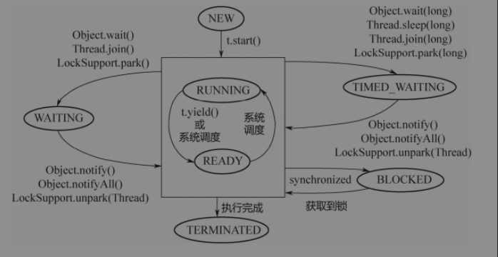

## 线程
线程 (Thread) 是操作系统进行运算调度的最小单元，是进程中的实际运行单位。一个进程可以有多个线程，每个线程都有各自的计数器、堆栈和局部变量等属性，并且能够访问共享内存变量。

`JVM` 中的线程和操作系统线程对应，采用抢占式的调度模型，每个线程在运行时只会占用一个 CPU，因此在多核多 CPU 的处理上使用多线程技术可以提供程序的执行效率。

### 线程状态
`JVM` 定义了线程在从创建到销毁的整个生命周期中的 6 种状态，线程在整个生命周期中的任意时间点有且只能有其中一种状态：

- **New**：线程已经创建但尚未调用 start 方法启动
- **Runnable**：此状态下线程有可能正在执行，也有可能正在等待 CPU 为它分配执行时间
- **Waiting**：处于这种状态的线程不会被分配 CPU 执行时间，它们要等待被其他线程显式的唤醒
- **Timed Waiting**：处于这种状态的线程也不会分配 CPU 执行时间，不过不需要等待被其他线程显式的唤醒或者在等待时间到达后会自动由系统唤醒
- **Blocked**：处于阻塞状态的线程阻塞的等待获取 `monitor` 锁从而进入`synchronized` 代码块或者 `synchronized` 方法
- **Terminated**：已经终止线程的线程状态，线程已经结束执行

线程在生命周期中并不是固定地处于某个状态，而是随着程序的运行在不同的状态之间切换


### 线程创建

线程对象在构造时需要提供线程所需要的属性，如线程所属的线程组、线程优先级、是否 Daemon 线程等。
```java
private void init(ThreadGroup g, Runnable target, String name,
                      long stackSize, AccessControlContext acc,
                      boolean inheritThreadLocals) {

  // 当前线程作为新创建线程的 parent 线程
  Thread parent = currentThread();
  
  // 从父线程继承线程组
  if (g == null) {
    g = parent.getThreadGroup();
  }
  this.group = g;
  
  // 从 parent 线程继承是否 Daemon 线程，优先级
  this.daemon = parent.isDaemon();
  this.priority = parent.getPriority();

  // 从 parent 线程继承 contextClassLoader
  this.contextClassLoader = parent.contextClassLoader;

  // 设置 target
  this.target = target;
  
  // 从 parent 线程继承可继承的 ThreaLocal
  this.inheritableThreadLocals = ThreadLocal.createInheritedMap(parent.inheritableThreadLocals);
  
  // 分配栈大小
  this.stackSize = stackSize;

  // 分配 ID
  tid = nextThreadID();
```

新创建的线程是以当前线程为父线程，在创建线程的过程中，子线程继承了父线程的属性并被分配了唯一的 ID 来标识线程。

### 线程中断

线程中断是指设置线程的中断标识位，线程中断通过调用线程的 `interrupte()` 方法触发，被中断的线程通过调用 `isInterrupted()` 方法判断是否被中断并对中断做出反应。

线程不能自己中断自己，必须由其他线程触发，线程检测到被中断后并不一定会抛出 `InterruptedException`，Java 中抛出 `InterruptedException` 的函数在抛出异常前会先调用`Thread.interrupted()` 方法将该线程的中断标识位复位。

```java
public void breakThread(Thread t){
    // false
    System.out.println(t.isInterrupted());
    t.interrupt();
    // true
    System.out.println(t.isInterrupted());
}
```
利用中断操作可以用于控制线程的取消和终止，这样在线程终止时可以清理资源：
```java
public class ThreadBreak {
    public static void main(String[] args) {
        Runner one = new Runner();
        Thread t = new Thread(one, "CountThread");
        t.start();
        t.interrupt();
        Runner two = new Runner();
        t = new Thread(two, "CountThread");
        t.start();
    }

    private static class Runner implements Runnable{

        private long i;
        private volatile boolean on = true;

        @Override
        public void run() {
            while (on && !Thread.currentThread().isInterrupted()){
                i++;
            }
            System.out.println("count = " + i);
        }
        
        public void cancel(){
            on = false;
        }
    }
}
```
### Daemon 线程

Daemon 线程主要用作程序中后台调度以及支持性工作，调用```Thread.setDaemon(true)```可以将线程设置为 Daemon 线程，设置 Daemon 线程需要在线程启动之前设置。
```java
public class DaemonThread {

    public static void main(String[] args) {
        Thread t = new Thread(() -> {
            try {
                TimeUnit.SECONDS.sleep(10);
            } catch (InterruptedException e) {
                e.printStackTrace();
            }finally {
                System.out.println("Daemon Finally !");
            }
        }, "DaemonThread");
        // 需要在启动 Daemon 线程前设置
        t.setDaemon(true);
        t.start();
    }
}
```
`JVM` 创建的线程默认都是非 Daemon 线程，存在非 Daemon 线程时进程不会退出，如果只存在 Daemon 线程时将会退出，虚拟机退出时 Daemon 线程中的 finally 代码块不一定会执行，因此不能在 Daemon 线程的 finally 语句块中做资源清理等逻辑。

### `ThreadLocal`
`ThreadLocal` 变量是一个以 `ThreadLocal` 对象为 key、任意对象为 value 的存储结构，这个结构被附带在线程上，也就是说一个线程可以根据一个 `ThreadLocal` 对象查询到绑定在这个线程上的一个值。

```java
public class Profiler {

    private static final ThreadLocal<Long> TIME_THREADLOCAL = ThreadLocal.withInitial(
        () -> System.currentTimeMillis());

    public static final void begin(){
        TIME_THREADLOCAL.set(System.currentTimeMillis());
    }
    public static final long end(){
        return System.currentTimeMillis() - TIME_THREADLOCAL.get();
    }
    public static void main(String[] args) throws InterruptedException {
        Profiler.begin();
        TimeUnit.SECONDS.sleep(1);
        System.out.println("Cost: " + Profiler.end());
    }
}
```
// todo ThreadLocal 内存泄露

### `LockSupport`
`LockSupport` 工具类定义了一组公共静态方法，这些方法提供了基本的线程阻塞和唤醒功能，成为构建同步组件的基础工具。

- ```LockSupport.park(blocker)```： 表示阻塞当前线程直到 unpark 或者线程被中断才返回，blocker 表示当前线程等待的对象，主要使用方式是 ```LockSupport.lock(this)```
- ```LockSupport.park(blocker, nanos)```： 带超时的阻塞直到 unpark 或者线程被中断才或者如果超时时间到达，当前线程才退出等待状态
- ```LockSupport.parkUntil(blocker, deadline)```： 阻塞到 deadline 时刻到达或者线程被中断，当前线程退出等待状态
- ```LockSupport.unpark(example.thread)```： 唤醒等待的线程
```java

```
### 等待/通知

等待/通知机制是指一个线程 A 调用了对象 O 的 `wait()` 方法进入等待状态而另一个线程 B 调用了对象 O 的 `notify()` 方法或者 `notifyAll()` 方法，线程 A 收到通知后从对象 O 的 `wait()` 方法返回进而执行后续的操作。

- 使用 `wait()`、`notify()`、`notifyAll()` 方法前需要先获取调用对象加锁
- 调用 `wait()` 方法后，线程状态由 Runnable 变更为 Waiting，释放当前线程持有的锁并将当前线程添加到锁对象的等待队列
- `notify` 和 `notifyAll` 方法调用后，等待线程需要等到 `notify` 或 `notifyAll` 释放锁后才有机会从 wait 方法返回
- `notify` 方法将等待队列中的一个线程移动到同步队列，`notifyAll` 方法将等待队列中的所有线程移动到同步队列，被移动的线程状态由 Waiting 转变为 Blocked
- 线程从 wait 方法返回的前提是获取到了调用对象的锁
- `notify` 或者 `notifyAll` 方法的调用并不会释放锁，只有在 synchronized 执行完毕才会释放锁

等待通知机制包含生产者和消费者两部分：生产者在获取到锁之后先调用 `notify` 唤醒消费者，然后在产生数据之后调用 `wait` 释放持有的锁，此时阻塞的消费者有机会获取到锁，然后消费完数据之后调用 `notify` 唤醒生产者线程并调用 `wait` 释放持有的锁：
```java
// 消费者
synchronized(lock) {
  lock.notify();
  consume_data();
  while(condition){
    lock.wait();
  }
}

// 生产者
synchronized(lock){
  // 改变条件使条件满足
  change_condition();
  // 通知等待在此对象上的线程
  lock.notifyAll();
}
```
使用等待/通知模型让两个线程交替打印奇偶数：
```java
public class WaitNotifyPrintOddEvent{
    private static int count = 0;
    private static final Object lock = new Object();
    
    Runnable odd = ()->{
        synchronized(lock){
            while(count <= 100 && count & 1 == 1){
            	System.out.println("Thread-" + Thread.currentThread().getName() + ": " + count++);
                if (cout <= 100){
                    lock.wait();
                }
            }
            lock.notify();
        }
    }
    
    Runnable even = ()->{
        
    }
    
    public static void main(String[] args){
        new Thread(r, "偶数线程").start();
    }
}
```
### 等待/超时
等待/超时机制是在等待/通知机制上添加一个超时时间：
```java
// 消费者
synchronized(lock){
    long future = System.currentTimeMillis() + timeout;
    long remaining = timeout;
    // 在等待时间内等待条件满足
    while(condition && remaining > 0){
        wait(remaining);
        remaining = future - System.currentTimeMillis();
    }
    doSomething();
}
```
使用等待/超时机制从数据库连接池获取连接：
```java
public class ConnectionPool{
    private LinkedList<Connection> pool = new LinkedList();
	
    public ConnectionPool(int initialSize){
        if(initialSize > 0){
            for(int i = 0; i < initialSize; i++){
                pool.addLast(ConnectionDriver.createConnection());
            }
        }
    }

    public void releaseConnection(Connection connection){
        if(connection != null){
            // 获取锁
            synchronized(pool){
                // 改变条件
                pool.addLast(connection);
                // 通知等待线程
                pool.notifyAll();
            }
        }
    }

    public Connection fetchConnection(long millis) throws InterruptedException{
        synchronized(pool){
            // 无限等待
            if(millis <= 0){
                while(pool.isEmpty()){
                    pool.wait();
                }
                return pool.removeFirst();
            }else{
                long future = System.currentTimeMillis() + millis;
                long remaining = millis;
                // 线程池为空则需要等待
                while(pool.isEmpty() && remaining > 0){
                    pool.wait(remaining);
                    remaining = future - System.currentTimeMillis();
                }
                Connection result = null;
                if(!pool.isEmpty()){
                    result = pool.removeFirst();
                }
                return result;
            }
        }
    }
}
```

**[Back](../../../basic-java/site/doc)**