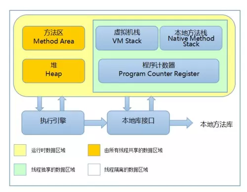

## 内存管理

Java 虚拟机自动管理着程序运行时的内存，而不需要在写程序时手动管理内存的申请与释放。

### 运行时数据区域

Java 虚拟机在执行 Java 程序的过程中会把它所管理的内存划分为若干个不同的数据区域，这些区域都有各自的用途以及创建和销毁时间。



#### 程序计数器 

程序计数器 (Program Counter Register) 是当前线程所执行的字节码的行号指示器，记录当前线程正在执行的虚拟机字节码指令的地址。

程序计数器是线程私有的，每个线程都有一个独立的程序计数器且各个线程之间的程序计数器互不影响。

#### 虚拟机栈

Java 虚拟机栈 (Java Virtual Machine Stack) 是线程私有的，每个方法在线程中调用的时候都会创建一个栈帧(stack frame)用于存储局部变量表、操作数栈、动态链接、方法出口等信息，每一个方法从调用到执行完成的过程就对应着一个栈帧在虚拟机栈中从入栈到出栈的过程。

栈帧中的局部变量表保存了编译器可知的各种基本数据类型、对象引用和指向返回指地址的指针。局部变量表的内存空间需要在编译期完成分配。

Java 虚拟机栈会出现两种异常情况：

- 线程请求的栈深度大于虚拟机所允许的深度将抛出 `StackOverflowError`
- 虚拟机栈可以动态扩展且扩展时无法申请到足够的内存就会抛出 `OutOfMemoryError`

```java
// -Xms20m -Xmx20m -XX:+HeapDumpOnOutOfMemoryError -Xss128k
example.threadlowError
public class StackOOM{
  static int stackLength = 1;
  public static void main(String[] args){
    stackLeak();
  }
  public static void stackLeak(){
    System.out.println(++stackLength);
    stackLeak();
  }
}
```

在使用多线程时，由于每个进程分配到的内存是有限制的，每个线程拥有独立的栈内存，当线程数过多导致内存溢出异常时可以通过减少栈容量或者减少最大堆内存来解决。

#### 本地方法栈

本地方法栈 (Native Method Stack) 和虚拟机栈的作用是相似的，只不过本地方法栈是为 Native 方法服务，而虚拟机栈是为虚拟机执行的 Java 方法服务。本地方法栈同样有可能抛出 `StackOverflowError` 和 `OutOfMemoryError`。

#### Java 堆

Java 堆(Java Heap)一般是 Java 虚拟机所管理的内存中最大的一块，是被所有线程共享的一块内存区域，在虚拟机启动的时候创建。几乎所有的对象实例都是在 Java 堆内分配内存，因此该内存区域是垃圾收集器管理的主要区域。

从内存回收的角度看，由于现代收集器基本都采用分代收集算法，所以 Java 堆还可以细分为：新生代(Eden 区、From Survivor 区、To Survivor 区)和老年代。

从内存分配的角度看，所有线程共享的 Java 堆中可能划分出多个线程私有的分配缓冲区(TLAB) 以提升对象分配时的效率。

Java 堆可以处于物理上不连续的内存空间中，只要逻辑上是连续的即可。Java 堆的实现一般是可扩展的(通过参数 -Xmx 和 -Xms 设置最大值和初始大小)，如果堆内存不足以分配实例并且堆无法扩展则会抛出 OutOfMemoryError：

```java
// -Xms20m -Xmx20m -XX:+HeapDumpOnOutOfMemoryError
// Exception in example.thread "main" java.lang.OutOfMemoryError: Java heap space
public class HeapOOM{
  public static void main(String[] args){
    List<Object> list = new ArrayList<>();
    while(true){
      list.add(new Object());
    } 
  }
}
```

#### 方法区

方法区(Method Area)是各个线程共享的内存区域，用于存储已被虚拟机加载的类信息、常量、静态变量等。方法区中由于存放的是类相关信息，因此垃圾收集的条件非常苛刻，所以垃圾收集的行为比较少。

JVM 虚拟机规范规定当方法区无法满足内存分配需求时，将会抛出 OutOfMemoryError。

### 对象创建

- **类加载**：检查这个指令的参数是否能在常量池中定位到一个类的符号引用，并且检查这个符号引用代表的类是否已经被加载、解析和初始化过，如果没有则需要加载这个类
- **分配内存**：对象所需内存大小在类加载时可以确定，将确定大小的内存从Java堆中划分出来
  - 指针碰撞：所有使用过的内存和空闲的内存以一个指针作为分界，分配内存时直接将指针挪动一段与对象大小相等的距离，指针碰撞法的前提是Java 堆中的内存是绝对规整的
  - 空闲列表：Java 虚拟机维护了一个列表，列表中记录了可用的内存块，分配对象的内存时需要从空闲列表中找到一块足够大的空间划分为对象实例，并更新列表上的记录
  - 多线程情况下需要保证并发安全，虚拟机采用了 CAS 分配空间和本地线程缓冲(Thread Local Allocatino Buffer, TLAB)两种方式用于分配对象的内存
    - CAS 采用失败重试的方式保证更新操作的原子性
    - 本地线程缓冲则是为每个线程在堆中预先分配一小块内存用于对象的内存分配，只有在分配的内存用完时才需要同步锁定分配新的内存，使用 `-XX: +UseTLAB` 启动 TLAB 功能
- **初始化内存空间**：保证对象的实例在Java代码中可以不赋值就可直接使用，能访问到这些字段的数据类型对应的零值（例如，int类型参数默认为0）
- **设置对象头**：设置对象的类的元数据信息、哈希码、GC分代年龄等
- **执行 <init> 方法初始化**：执行静态方法、静态代码块、构造函数等对象初始化方法

### 对象内存布局

在 HotSpot 虚拟机中，对象在内存中存储的布局可以分为3块区域：对象头(Header)、实例数据(Instance Data)和对齐填充(Padding)。

HotSpot 虚拟机的对象头包括两部分信息，第一部分信息用于存储对象自身的运行时数据，如哈希码、GC 分代年龄、锁状态标识、线程持有的锁、偏向线程 ID、偏向时间戳等，这部分数据称为 Mark Word。对象头的另外一部分信息是对象指向它的的类元数据的指针，虚拟机通过这个指针来确定这个对象是哪个类的实例。

实例数据部分是对象真正存储的有效信息，也是在程序代码中所定义的各种类型的字段内容，无论是从父类继承的还是在子类中定义的都需要记录下来。

对齐填充不是必须的，没有特别的含义，仅仅是为了使对象的大小是 8 字节的整数倍。

**[Back](../)**