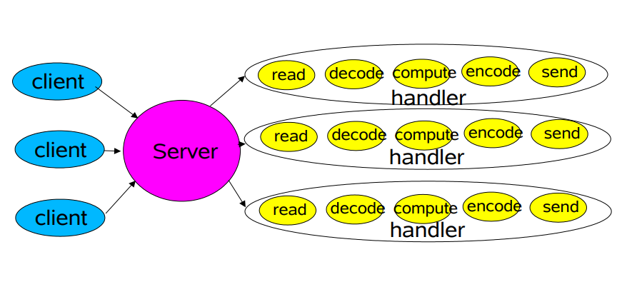
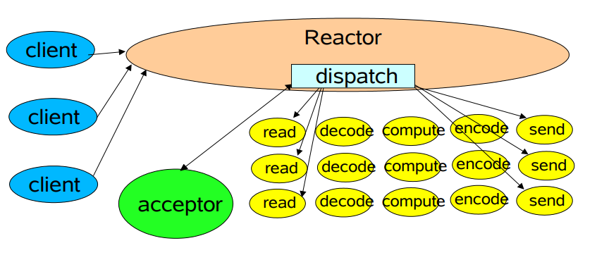
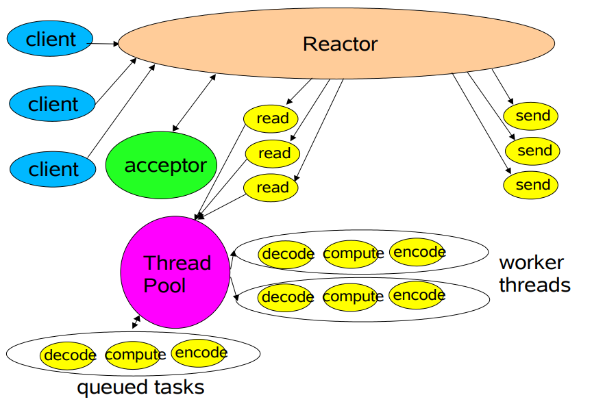
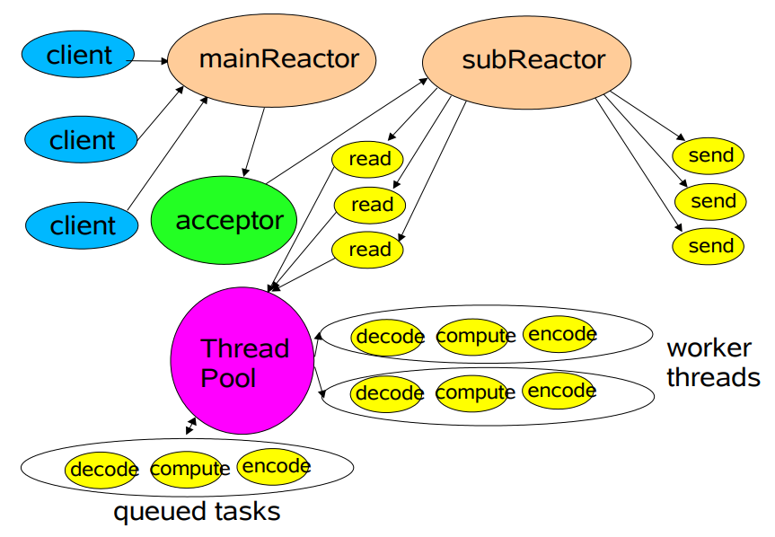

## Reactor

Reactor 是一种事件处理模型，用于处理由多个输入并发的传递给服务处理程序的请求，服务处理程序将传入的请求进行多路分解，然后同步的分发给相应的处理器处理。

Reactor 模型两个核心组件：
- 同步事件多路分解器：使用事件循环来阻塞所有的资源操作，当可以在资源上无阻塞的执行同步操作时将其分分解到 Dispatcher 上
- 事件分发器：事件分发器用于注册事件处理器，并且分发多路分解器的同步操作到对应的处理器上

### 传统服务设计模式

在传统的服务设计模式中，每一个连接都会创建一个新的线程用于处理连接的所有事件，在有大量客户端连接时会受到系统线程数限制，且线程的创建和销毁会消耗大量系统资源。

### 单 Reactor 单线程

Selector 可以实现应用程序通过一个阻塞对象监听多路连接请求，Reactor 对象通过 Selector 监听客户端请求事件，收到事件后通过  Dispatch 进行分发，如果是建立连接请求事件，由  Acceptor 通过 accept 处理连接请求，然后创建一个 Handler 对象处理连接完成后的后续业务处理；如果不是建立连接事件，则 Reactor 会分发调用连接对应的额Handler 来响应；Handler 会完成 Read->业务处理-> Send 的完成业务流程

单 Reactor 单线程模型使用一个线程通过多路复用完成所有 IO 操作，在客户端连接数量较多时无法支撑

### 单 Reactor 多线程

Reactor 对象通过 select 监控客户端请求事件，收到事件后通过 dispatcher 进行分发，如果建立连接请求，则由 Acceptor 通过 accept 处理连接请求，然后创建一个 Handler 对象处理完成连接后的各种事件；如果不是连接请求则由 reactor 分发调用连接对应的 handler 来处理，Handler 只负责响应事件，不做具体的业务处理，通过 read 读取数据后分发给 Worker 线程池的线程处理业务；Worker 线程处理完业务后将结果返回给 Handler;hander 收到相应后通过 send 将结果返回给 client

将业务处理与数据读写分离，利用多线程完成复杂业务处理
Reactor 处理了所有的事件监听和响应，在单线程运行，在高并发场景容易出现瓶颈

### 主从 Reactor 多线程

MainReactor 监听连接事件，收到事件后通过 Acceptor 处理连接事件；当 Acceptor 处理连接事件后将连接分配到 SubReactor，SubReactor 将连接加入到连接队列进行监听，并创建 Handler 处理各种事件；当有新事件发生时，SubReactor 就会调用对应的 Handler 处理，Handler 读取数据后会分发到后面的 workder 线程处理，worker 线程处理完数据后将结果返回 Handler，handler 接收到响应结果后返回给 Client

MainReactor 可以对应多个 Reactor 子线程

父线程与子线程的数据交互职责简单明确，父线程只需要接收新连接，子线程完成后续的业务处理

父线程与子线程的数据交互简单，Reactor 主线程只需要把新连接传给子线程，子线程无需返回数据

### Proactor