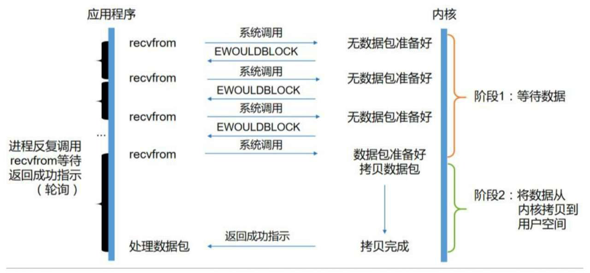
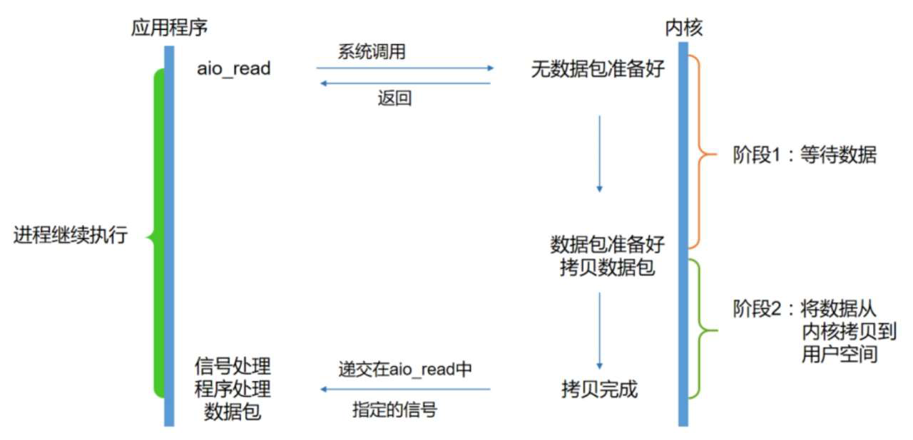

## I/O 模型

操作系统为了将内核和进程隔离开，将虚拟内存划分为**内核空间**和**用户空间**，其中系统内核运行在内核空间，用户进程运行在用户空间，用户空间的进程不能直接访问内核空间，而需要通过系统调用(`system call`)。

操作系统利用 CPU 不同的运行级别将运行状态划分为**内核态**和**用户态**，其中内核运行在内核态，具有最高的权限，可以执行所有操作。运行在用户空间的进程通过系统调用访问内核空间时，需要由内核完成内核空间的访问，此时 CPU 需要从用户态切换到内核态，此时需要保存用户空间的参数。

Linux 将所有的设备都看做文件，进程的 I/O 是通过操作调用系统命令返回文件描述符 (file descriptor, fd）来完成。进程在发起系统调用后，内核会先查看缓冲区中是否有数据，如果没有就会从 I/O 设备中读取，然后将数据复制到用户空间，因此整个 I/O 过程分为两步：

- 从 I/O 设备读取数据到缓冲区
- 将缓冲区中的数据复制到用户进程

Unix 根据不同的实现划分为 5 中 I/O 模型：阻塞 I/O、非阻塞 I/O、多路复用 I/O 和异步 I/O。

### 阻塞 I/O

应用进程发起 `recvfrom` 系统调用，其系统调用直到数据包到达且被复制到应用进程的缓冲区中或者发生错误才返回，在此期间应用进程都是被阻塞的，因此称为阻塞 I/O 模型。

### 非阻塞 I/O

应用进程发起 `recvfrom` 系统调用后，如果缓冲区没有数据就直接返回 `EWOULDBLOCK` 错误，一般都对非阻塞 I/O 模型进行轮询检查这个状态，看内核是不是有数据到来，这个过程中应用进程并没有一直阻塞等待数据到来，因此称为非阻塞 I/O 模型 。

非阻塞模型需要不断的轮询系统调用，使得进程不断的在用户态和内核态切换，影响 CPU 的性能。

### I/O 复用

应用进程将文件描述符(fd)传递给 `select` 系统调用，通过操作系统的 `select` 侦测多路 fd 是否处于就绪状态，然后调用 `recvfrom` 系统命令读取就绪的数据包。

Linux 提供了 epoll 系统调用代替 `select`，epoll 使用信号驱动方式代替顺序扫描，当 fd 就绪时立即调用回调函数 rollback，因此性能会更高。

多路复用模型并没有减少进程的等待时间，但是由于 `select` 可以侦测多路 fd，在需要大量 I/O 操作时减少了进程间的切换。

### 信号驱动 I/O

信号驱动模型通过系统调用` sigaction` 向内核注册信号处理函数，此系统调用立即返回，进程继续工作，它是非阻塞的。当数据准备就绪时，就为该进程生成一个 SIGIO 信号，通过信号回调通知应用程序调用 recvfrom 来读取数据。

### 异步 I/O

应用进程发起 `aio_read` 系统调用后直接返回，内核在将数据拷贝到用户空间后发送指定的信号

